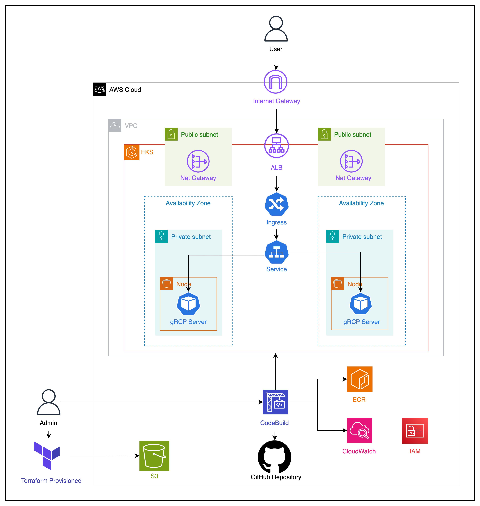

# GRPC en EKS

La siguiente solución describe cómo utilizar los módulos de Terraform presentes en el actual repositorio para el despliegue automático de microservicios basados en gRPC en un clúster de Amazon EKS y exponerlos de forma segura mediante un ALB.

## Arquitectura de la solución

La solución comienza con un módulo reutilizable de terraform, diseñado para crear los componentes de **Networking** requeridos para exponer de forma segura diferentes microservicios mediante un **Application Load Balancer** y a su vez permitir la comunicación entre ellos bajo el protocolo **gRCP**.
El segundo módulo de terraform se centra en la creación de un **clúster de EKS** con los accesos requeridos para alojar y gestionar eficientemente los microservicios.
Finalmente el tercer módulo de terraform se dedica a garantizar un despliegue fluido y automatizado de los microservicios mediante un pipeline **CI/CD** en **AWS CodeBuild**, asegurando así la entrega contínua.

El siguiente diagrama ilustra la arquitectura de la solución:



## Detalles a nivel de networking

El flujo inicia cuando un usuario envía una patición al servidor gRCP mediante el Application Load Balancer a través del protocolo HTTP/2. El **Internet Gateway** enruta y permite el tráfico de internet al ALB dentro de la VPC. El **Application Load Balancer** envía la petición a los Target groups definidos que apuntan a los nodos de EKS que contienen los pods del servidor. En este punto el **Ingress** de kubernetes configurado para nuestra aplicación permite el tráfico al **service** y este a su vez permite el acceso a los pods que alojan el servidor. 

## Guía de despliegue


### Requisitos previos
* Tener una cuenta de [AWS](https://aws.amazon.com/es/free/?trk=8fa18207-f2c2-4587-81a1-f2a3648571b3&sc_channel=ps&ef_id=EAIaIQobChMIkZ_atoe9iwMVaKVaBR0J6xCJEAAYASAAEgIjFfD_BwE:G:s&s_kwcid=AL!4422!3!647999789205!e!!g!!aws!19685287144!146461596896&gclid=EAIaIQobChMIkZ_atoe9iwMVaKVaBR0J6xCJEAAYASAAEgIjFfD_BwE&all-free-tier.sort-by=item.additionalFields.SortRank&all-free-tier.sort-order=asc&awsf.Free%20Tier%20Types=*all&awsf.Free%20Tier%20Categories=*all)
* Tener instalado [Terraform](https://developer.hashicorp.com/terraform/tutorials/aws-get-started/install-cli) 
* Tener instalado [Git](https://git-scm.com/book/es/v2/Inicio---Sobre-el-Control-de-Versiones-Instalaci%C3%B3n-de-Git)
* Tener un bucket de [S3 para el backend de Terraform](https://developer.hashicorp.com/terraform/language/backend/s3)
* CLI de [AWS](https://docs.aws.amazon.com/cli/latest/userguide/install-cliv2.html)

### Despliegue

1. Clonar el repositorio de GitHub [GRCP-EKS](https://github.com/JulianaLeonGonzalez/GRCP-EKS/blob/master/README.md) en su máquina local e ingresar al directorio "terraform" dentro del repositorio clonado.
```bash
git clone https://github.com/JulianaLeonGonzalez/GRCP-EKS
cd GRCP-EKS/terraform
```

2. En cada uno de los módulos encontrará un archivo _variables.tf_ con las variables disponibles para personalizar del módulo, se recomienda revisar y modificar las variables según sus necesidades.

3. En el archivo provider.tf ubicado en el directorio "terraform" indicar los datos del bucket de S3 donde deseamos guardar el estado de Terraform, aunque no es obligatorio, se recomienda descomentar la línea _dynamodb_table_ para indicar la tabla de dynamo que usaremos y permitir el bloqueo de estado, siguiendo las mejores prácticas.

4. Inicializar el directorio de trabajo de Terraform y descargar los proveedores mediante el siguiente comando.
```bash
terraform init
```
5. Crear los recursos definidos en el módulo principal de Terraform mediante el siguiente comando.
```bash
terraform apply
```
6. Una vez finalizado el comando anterior se creará el rol "codebuild_role", el siguiente paso es editarlo en el archivo de configuración _CodeBuild/codebuild.tf_ descomentando el único bloque que aparece comentado y comentar el recurso justo arriba de el, para de esta forma asignarle los permisos _sts:AssumeRole_.
7. Ejecutar nuevamente el comando _terraform apply_ para aplicar los cambios realizados.
```bash
terraform apply
```
8. El desarrollador debe actualizar los archivos _manifest.yaml_ y _auth-configmap.yaml_ con los datos de su despliegue. Por ejemplo, en el recurso Deployment actualizar los datos de la iamgen de contenedor. 
9. Ubicarnos nuevamente en el directorio principal _GRCP-EKS_ y crear los recursos definidos en el _auth-configmap.yaml_ mediante el siguiente comando.
```bash
kubectl apply -f auth-configmap.yaml
```
10. Instalar el Helm AWS Load Balancer Controller en el clúster de EKS  [Helm AWS Load Balancer Controller](https://docs.aws.amazon.com/eks/latest/userguide/lbc-helm.html) en su máquina local. 

11. Ejecutar el pipelide de CodeBuild para desplegar los microservicios en el clúster de EKS, para ello ingresaremos a la consola de AWS y en el buscador ingresaremos el servicio _CodeBuild_, en la consola de CodeBuild seleccionaremos el proyecto creado y daremos click en el botón "Start build" para iniciar el build y deployment de la solución.

## Links de referencia

Python gRCP cliente - servidor
* https://realpython.com/python-microservices-grpc/
* https://www.aubergine.co/insights/building-for-scale-enterprise-communication-the-strategic-advantage-of-grpc

Arquitectura de la solución
* https://docs.aws.amazon.com/prescriptive-guidance/latest/patterns/deploy-a-grpc-based-application-on-an-amazon-eks-cluster-and-access-it-with-an-application-load-balancer.html#deploy-a-grpc-based-application-on-an-amazon-eks-cluster-and-access-it-with-an-application-load-balancer-additional
* https://docs.aws.amazon.com/eks/latest/userguide/lbc-helm.html
* https://docs.aws.amazon.com/es_es/eks/latest/userguide/auto-configure-alb.html

Uso de terraform para aprivisionamiento de infrastructura
* https://registry.terraform.io/providers/hashicorp/aws/latest/docs
* https://medium.com/@StephenKanyiW/provision-eks-with-terraform-helm-and-a-load-balancer-controller-821dacb35066
* https://www.cloudforecast.io/blog/using-terraform-to-deploy-to-eks/
* https://github.com/LukeMwila/amazon-eks-cluster/tree/master
* https://github.com/aws-samples/grpc-traffic-on-alb-to-eks/blob/main/kubernetes/grpc-sample.yaml
* https://navyadevops.hashnode.dev/step-by-step-guide-creating-an-eks-cluster-with-alb-controller-using-terraform-modules#heading-5-creating-iam-group-and-adding-user
* https://medium.com/@sahibgasimov/terraform-mastery-deploying-eks-cluster-custom-module-with-alb-ingress-controller-and-external-dns-9fe328de9f95
* https://repost.aws/questions/QUGNQwcRe4SU6BjhZYpHixXg/eks-aws-load-balancer-controller-ingress-created-but-the-alb-is-not

Uso de CodeBuild para CI/CD
* https://hewi.blog/adding-cicd-with-aws-codepipeline-to-an-eks-cluster-using-terraform
* https://github.com/aquasecurity/amazon-eks-devsecops/blob/master/buildspec.yml
* https://achinthabandaranaike.medium.com/how-to-create-and-manage-aws-eks-cluster-with-aws-cicd-pipeline-e4999e55a37d
* https://devopslearning.medium.com/ci-cd-pipeline-for-eks-using-codecommit-codebuild-codepipeline-and-elastic-container-100f4b85e434

Aprendizaje contínuo
* https://ibm-learning.udemy.com/course/hashicorp-terraform/
* https://ibm-learning.udemy.com/course/terraform-fast-track/


